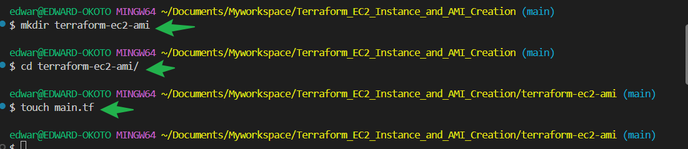
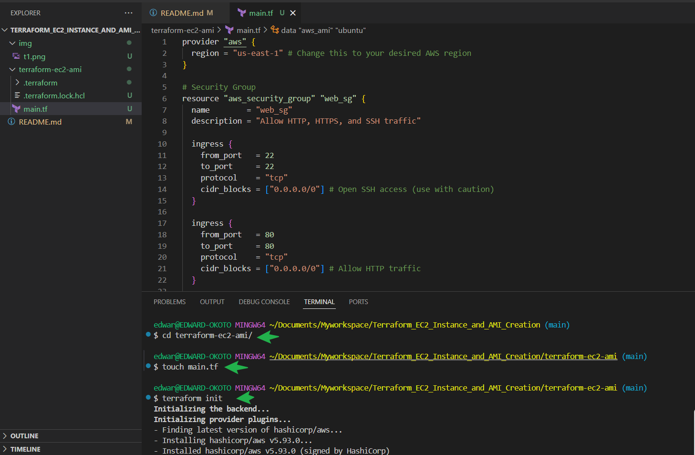
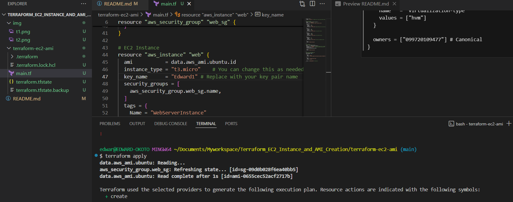
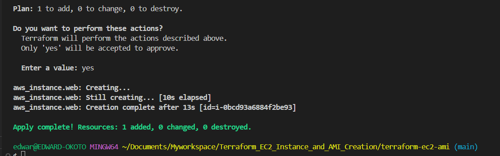
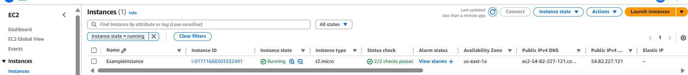
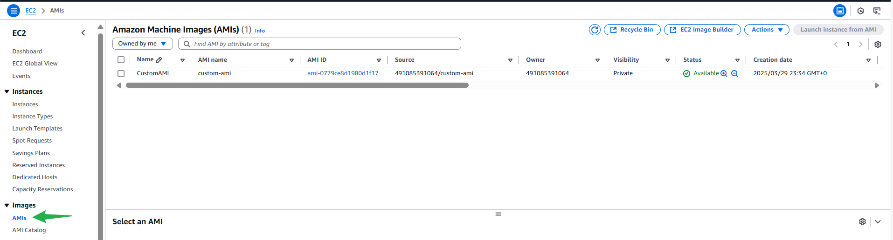
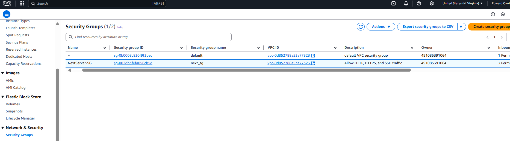

# Terraform_EC2_Instance_and_AMI_Creation


## Purpose

We will use Terraform to automate the creation of an EC2 instance on AWS and then create an Amazon Machine Image (AMI) from that instance.

---

## Objectives

1.Terraform configuration
- We will learn how to write basic terraform configuration file.

2.EC2 Instance Creation
- We will use Terraform to create an EC2 instance on AWS

3.AMI Creation
- Automate the creation of an AMI from the created EC2 instance.

---

## Project Task

**Task 1: Terraform configuration for EC2 instance**

1. Create a new directory for your terraform project `terraform-ec2-ami`
2. Inside the project directory, create a terraform configuration file `main.tf`

   

3. Write Terraform code to create an EC2 instance- Specify instance type,key pair,security group etc.
4. Initiate the Terraform project using the command `terraform init`


`main.tf` code

```hcl
provider "aws" {
  region = "us-east-1" # Change this to your desired AWS region
}

# Security Group
resource "aws_security_group" "web_sg" {
  name        = "web_sg"
  description = "Allow HTTP, HTTPS, and SSH traffic"

  ingress {
    from_port   = 22
    to_port     = 22
    protocol    = "tcp"
    cidr_blocks = ["0.0.0.0/0"] # Open SSH access (use with caution)
  }

  ingress {
    from_port   = 80
    to_port     = 80
    protocol    = "tcp"
    cidr_blocks = ["0.0.0.0/0"] # Allow HTTP traffic
  }

  ingress {
    from_port   = 443
    to_port     = 443
    protocol    = "tcp"
    cidr_blocks = ["0.0.0.0/0"] # Allow HTTPS traffic
  }

  egress {
    from_port   = 0
    to_port     = 0
    protocol    = "-1"
    cidr_blocks = ["0.0.0.0/0"] # Allow all outbound traffic
  }

  tags = {
    Name = "WebSecurityGroup"
  }
}

# EC2 Instance
resource "aws_instance" "web" {
  ami           = data.aws_ami.ubuntu.id
  instance_type = "t3.micro" # You can change this as needed
  key_name      = "your-key-pair-name" # Replace with your key pair name
  security_groups = [
    aws_security_group.web_sg.name,
  ]

  tags = {
    Name = "WebServerInstance"
  }
}

# Fetch the latest Ubuntu AMI
data "aws_ami" "ubuntu" {
  most_recent = true

  filter {
    name   = "name"
    values = ["ubuntu/images/hvm-ssd/ubuntu-jammy-22.04-amd64-server-*"]
  }

  filter {
    name   = "virtualization-type"
    values = ["hvm"]
  }

  owners = ["099720109477"] # Canonical
}
```





**Task 1: AMI creation**

1. Extend your terraform configuration to include the creation of an AMI.
- Navigate to your `terraform-ec2-ami` directory
2. Inside the project directory, create a terraform configuration file `nan-_main.tf`
3. Copy and paste the snippet into the file.

```hcl
provider "aws" {
  region = "us-east-1" # Change this to your desired AWS region
}

# Create an EC2 instance
resource "aws_instance" "example_instance" {
  ami           = "ami-0c55b159cbfafe1f0" # Specify your desired AMI ID
  instance_type = "t2.micro"
  key_name      = "Edward1" # Specify your key pair name

  # Add other necessary configuration for your instance (e.g., subnet, security group, etc.)
}

# Create a custom AMI based on the EC2 instance
resource "aws_ami" "example_ami" {
  name        = "example-ami"
  description = "Example AMI created with Terraform"
  source_instance_id = aws_instance.example_instance.id

  # Add any additional settings or configuration for your AMI
}
```
4. Initialise the Terraform project using the command `terraform init`

    These commmands can be run before applying.

- **`terraform fmt`**: Formats Terraform code for consistency and readability.  
- **`terraform validate`**: Checks the configuration files for syntax errors.  
- **`terraform plan`**: Shows the changes Terraform will apply before execution.  
 
  
5. Apply the configuration using `terraform apply`and confirm the configuration of EC2 instance and AMI.

6. **Experiment by changing the instance type or adding additional resources**

#### Updated Configuration:

```hcl
provider "aws" {
  region = "us-east-1" # Change this to your preferred AWS region
}

# Security Group
resource "aws_security_group" "next_sg" {
  name        = "next_sg"
  description = "Allow HTTP, HTTPS, and SSH traffic"

  ingress {
    from_port   = 22
    to_port     = 22
    protocol    = "tcp"
    cidr_blocks = ["0.0.0.0/0"] # Allow SSH (modify to restrict access for security)
  }

  ingress {
    from_port   = 80
    to_port     = 80
    protocol    = "tcp"
    cidr_blocks = ["0.0.0.0/0"] # Allow HTTP
  }

  ingress {
    from_port   = 443
    to_port     = 443
    protocol    = "tcp"
    cidr_blocks = ["0.0.0.0/0"] # Allow HTTPS
  }

  egress {
    from_port   = 0
    to_port     = 0
    protocol    = "-1"
    cidr_blocks = ["0.0.0.0/0"] # Allow all outbound traffic
  }

  tags = {
    Name = "NextServer-SG"
  }
}

# EC2 Instance with Updated Type
resource "aws_instance" "example_instance" {
  ami           = data.aws_ami.ubuntu.id
  instance_type = "t3.medium" # Updated to a larger instance type
  key_name      = "Edward1"  # Replace with your key pair name
  security_groups = [
    aws_security_group.next_sg.name,
  ]

  tags = {
    Name = "UpdatedExampleInstance"
  }
}

# Data Source for the Latest Ubuntu AMI
data "aws_ami" "ubuntu" {
  most_recent = true

  filter {
    name   = "name"
    values = ["ubuntu/images/hvm-ssd/ubuntu-jammy-22.04-amd64-server-*"]
  }

  filter {
    name   = "virtualization-type"
    values = ["hvm"]
  }

  owners = ["099720109477"] # Canonical
}

# Create Custom AMI from the Instance
resource "aws_ami_from_instance" "custom_ami" {
  source_instance_id = aws_instance.example_instance.id
  name               = "custom-ami"
  description        = "Custom AMI with updated instance type"

  tags = {
    Name = "UpdatedCustomAMI"
  }
}

# Additional Resources: S3 Bucket
resource "aws_s3_bucket" "example_bucket" {
  bucket = "example-terraform-s3-bucket-12345" # Use a globally unique name
  acl    = "private"

  tags = {
    Name        = "ExampleS3Bucket"
    Environment = "Dev"
  }
}

# Additional Resources: CloudWatch Log Group
resource "aws_cloudwatch_log_group" "example_log_group" {
  name              = "/example/log/group"
  retention_in_days = 7

  tags = {
    Name = "ExampleLogGroup"
  }
}
```

#### Key Changes:
1. **Updated Instance Type:**
   - Changed the `instance_type` from `t2.micro` to `t3.medium` for more performance (CPU and memory). Adjust as per your needs or budget.

2. **Amazon S3 Bucket:**
   - Added a private S3 bucket named `example-terraform-s3-bucket-12345`. This can be used for storage (e.g., storing application files or logs). Ensure the bucket name is unique globally.

3. **CloudWatch Log Group:**
   - Added a CloudWatch log group to capture application or system logs. Logs will be retained for 7 days by default.

##### How to Test:
1. Save the updated code into your `.tf` file.
2. Run:
   ```bash
   terraform init
   terraform plan
   terraform apply
   ```
3. Verify the resources are created in your AWS Management Console (under EC2, S3, and CloudWatch).

Confirm EC2 instance was created in AWS



Confirm AMI was created in AWS



Confirm Security group created in AWS




